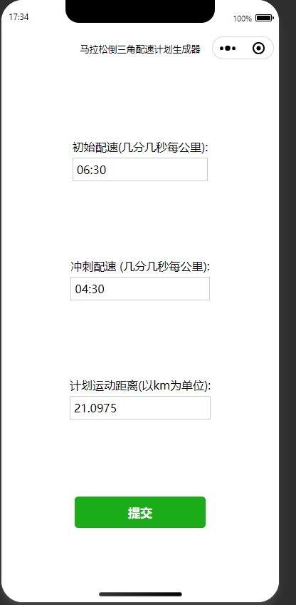
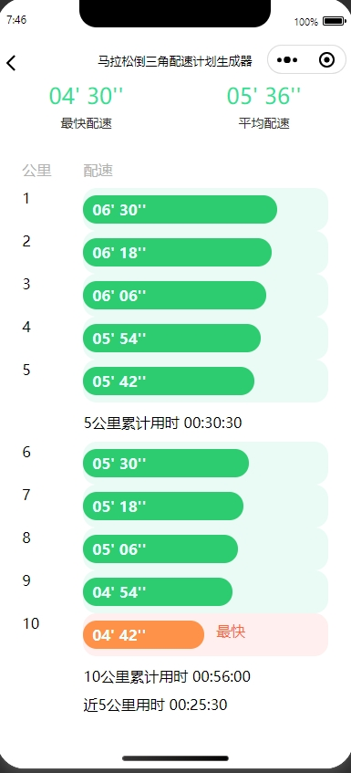

    
    
     
    
    
    
    

# 马拉松倒三角计划配速生成器
 + 此项目是一个微信小程序项目，长距离的运动需要循序渐进的由慢变快的模式，有计划有目的的合理分配体力，才不会受伤，此小程序主要就是解决此类极限运动的配速配置的业务场景。

#### 开发环境

+ Windows

#### 配置环境

+ 啥都没配置                

#### 开发工具

+ [微信开发者工具](https://developers.weixin.qq.com/miniprogram/dev/devtools/download.html)

####  编码规范

- 规范方式：严格遵守阿里编码规约。
- 命名统一：简介最大程度上达到了见名知意。
- 分包明确：层级分明可快速定位到代码位置。
- 注释完整：描述性高大量减少了开发人员的代码阅读工作量。
- 工具规范：使用统一jar包避免出现内容冲突。
- 代码整洁：可读性、维护性高。

#### 包的作用

| 包              | 作用                          |
| :-------------- | ----------------------------- |

#### 项目运行

+ 利用微信开发者工具运行

#### 技术选型：

+ 木有啥框架也木有啥选型，就是纯wxml,wxcss,js

#### 项目效果简介

#### 参考链接

1. [微信小程序官方API](https://developers.weixin.qq.com/miniprogram/dev/api/)