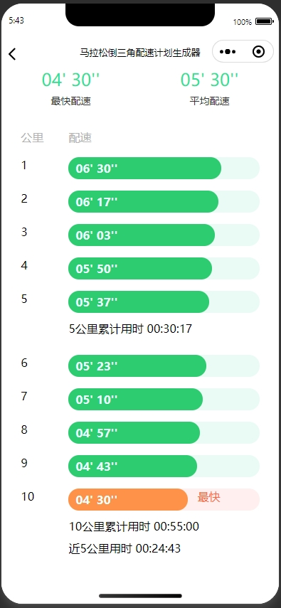

<p align="center">
     <a href='https://docs.oracle.com/en/java/javase/8'></a>
    <a href='https://docs.spring.io/spring-boot/docs/2.6.2-SNAPSHOT/reference/html'></a>
    <a href='https://staging-cn.vuejs.org'></a><br/>
    <a href='#'></a>
    <a href='#'></a>
    <a href='#'></a>
    <a href='#'></a>
</p>

# 马拉松倒三角计划配速生成器
 + 此项目是一个微信小程序项目，长距离的运动需要循序渐进的由慢变快的模式，有计划有目的的合理分配体力，才不会受伤，此小程序主要就是解决此类极限运动的配速配置的业务场景。

### 开发环境

+ Windows

### 配置环境

+ 啥都没配置                

### 开发工具

+ [微信开发者工具](https://developers.weixin.qq.com/miniprogram/dev/devtools/download.html)

###  编码规范

- 规范方式：严格遵守阿里编码规约。
- 命名统一：简介最大程度上达到了见名知意。
- 分包明确：层级分明可快速定位到代码位置。
- 注释完整：描述性高大量减少了开发人员的代码阅读工作量。
- 工具规范：使用统一jar包避免出现内容冲突。
- 代码整洁：可读性、维护性高。

### 包的结构 
```
+- marathonInvertedTriangle -- 项目根目录
|   +- .eslintrc.js -- ESLint 配置文件，用于定义代码的 linting 规则，确保代码风格一致。
|   +- .git -- Git 版本控制目录
|   +- .vscode -- Visual Studio Code 配置目录
|   |   +- settings.json -- Visual Studio Code 的项目特定设置文件
|   +- app.js -- 小程序的全局逻辑文件，包含小程序的生命周期函数和全局数据。
|   +- app.json -- 小程序的全局配置文件，定义了页面路径、窗口表现、网络超时时间等。
|   +- app.wxss -- 小程序的全局样式文件，定义了全局的 CSS 样式。
|   +- Images -- 存放图片资源的目录，用于存储小程序中使用的图片文件。
|   +- pages -- 存放小程序页面的目录，每个页面包含一个独立的文件夹。
|   |   +- components -- 组件
|   |   |   +- InfoColumn -- 信息行组件
|   |   |   +- PickerItem -- 选择框组件
|   |   |   +- SubmitButton -- 提交按钮组件
|   |   +- index -- 首页的页面文件。
|   |   |   +- index.js -- 首页的逻辑文件，包含页面的生命周期函数和数据。
|   |   |   +- index.json -- 首页的配置文件，定义了页面的路径、导航栏标题等。
|   |   |   +- index.wxml -- 首页的结构文件，定义了页面的布局和结构。
|   |   |   +- index.wxss -- 首页的样式文件，定义了页面的 CSS 样式。
|   |   +- logs -- 日志页面的文件。
|   |   |   +- logs.js -- 日志页面的逻辑文件。
|   |   |   +- logs.json -- 日志页面的配置文件。
|   |   |   +- logs.wxml -- 日志页面的结构文件。
|   |   |   +- logs.wxss -- 日志页面的样式文件。
|   |   +- paceChart -- 配速图表页面的文件。
|   |   |   +- paceChart.js -- 配速图表页面的逻辑文件。
|   |   |   +- paceChart.json -- 配速图表页面的配置文件。
|   |   |   +- paceChart.wxml -- 配速图表页面的结构文件。
|   |   |   +- paceChart.wxss -- 配速图表页面的样式文件。
|   +- project.config.json -- 小程序项目的配置文件，包含项目的基本信息和开发工具的配置。
|   +- project.private.config.json -- 小程序项目的私有配置文件，包含一些敏感信息，如云开发配置等。
|   +- README.md -- 项目的说明文件
|   +- sitemap.json -- 小程序的sitemap配置文件，用于定义页面的访问规则和搜索引擎抓取规则。
|   +- utils -- 存放工具函数的目录，包含一些通用的辅助函数。
|   |   +- common.js -- 通用工具函数，如时间格式化、数据转换等。
|   |   +- distancePicker.js -- 距离选择器的工具函数。
|   |   +- timePicker.js -- 时间选择器的工具函数。
|   |   +- util.js -- 其他通用工具函数。
```

### 项目运行

+ 利用微信开发者工具运行

### 技术选型：

+ 木有啥框架也木有啥选型，就是纯wxml,wxcss,js


### 项目效果简介




### 项目二维码


### 通过此项目GET

#### 微信开发工具快捷键

1. 格式化代码 shift + alt + f

### 参考链接

1. [微信小程序官方API](https://developers.weixin.qq.com/miniprogram/dev/api/)